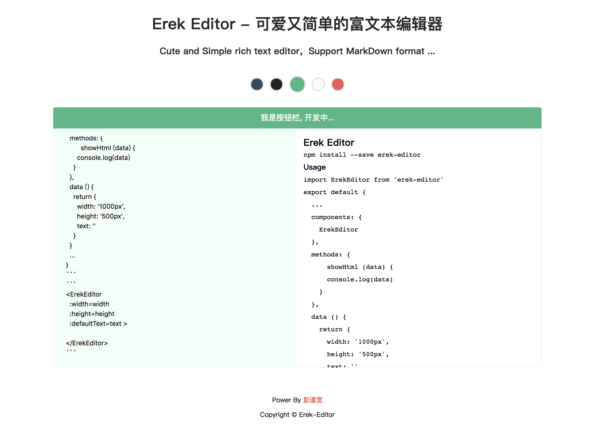

## Erek-Editor
1 . Cute and Simple rich text editor

2 . Support MarkDown format

3 . .....(There will be more follow ups)

------

## Demo



## [Link](http://www.pengdaokuan.cn/ErekEditor)

--------
## Usage
### 1.1 Installation
```javascript
  npm install erek-editor --save
```
### 1.2 ES6 Import
```javascript
  import ErekEditor from 'erek-editor'
  
  export default {
    components: {
      ErekEditor
    }
  }
```

## Basic Example
html
```html
  <template>
    <div>
      <erek-editor
        :width=width
        :height=height
        :defaultText=text
        >
      </erek-editor>
    </div>
  </template>
```

js
```javascript
  import ErekEditor from 'erek-editor'
  import text from './defaultText/text' // default Text

  export default {
    components: {
      ErekEditor
    },
    data () {
      return {
        width: '1000px',
        height: '520px',
        text: text
      }
    }
  }

```

### Props
props | type | default | description
---|---|---|---
width | String | 900px | erek editor width
height | String | 500px | erek editor height
text | String |  | defalut Text
