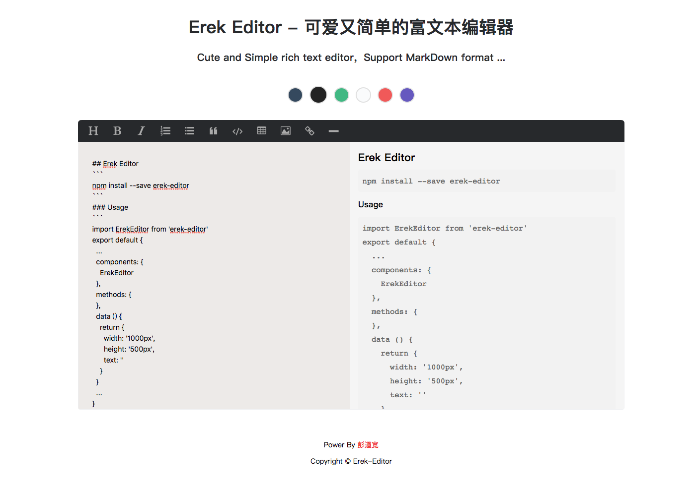
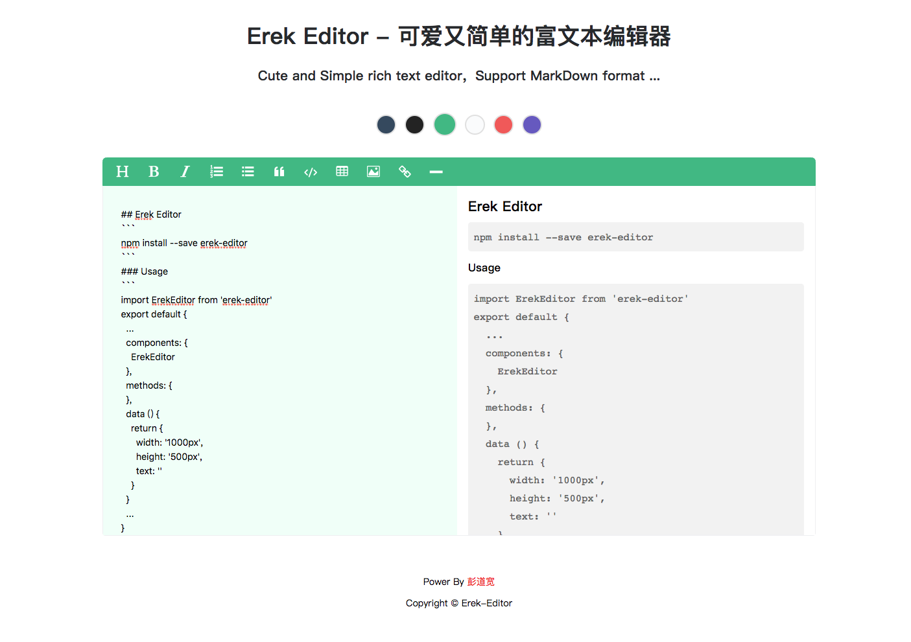

# Erek-Editor


## Introduce
1 . Cute and Simple rich text editor

2 . Support MarkDown format

3 . .....(There will be more follow ups)

------

## Demo





--------

## Display

Demo Link: http://www.pengdaokuan.cn/ErekEditor

---------

## Usage
### 1.1 Installation
```javascript
  npm install erek-editor --save
```
### 1.2 ES6 Import
```javascript
  import ErekEditor from 'erek-editor'
  
  export default {
    components: {
      ErekEditor
    }
  }
```

## Basic Example
html
```html
  <template>
    <div>
      <erek-editor
        :width='width'
        :height='height'
        :defaultText='text'
        :theme='theme'  
      >
      </erek-editor>
    </div>
  </template>
```

js
```javascript
  import ErekEditor from 'erek-editor'
  import text from './defaultText/text' // default Text

  export default {
    components: {
      ErekEditor
    },
    data () {
      return {
        width: '1000px',
        height: '520px',
        text: text,
        theme: 'default'
      }
    }
  }

```

### Props
props | type | default | description
---|---|---|---
width | String | 900px | erek editor width
height | String | 500px | erek editor height
text | String |  | defalut Text
theme | String | default | default、green、gray、dark、princess、purple |

-----

### How add Theme ?
#### App.vue
```html
  <!-- The theme name you want to add is 'xxx' -->
  
  <!-- template -->
  <div class='themes' @click='selectTheme'>
    ...
    <span data-theme='xxx'></span>
    ...
  </div>

  <!-- css -->
  .themes {
    ...
    span {
      &:nth-child(7){
        <!-- 主页圆圈的背景色 -->
        background-color: #6659bf; 
      }
    }
  }

```
#### lib / theme.js
```javascript
  const theme = {
    ...
    xxx: {
      menuColor: '#6992bf', // 颜色
      menuBorder: '1px solid #35495e', // border边框样式
      hoverColor: '#88bcf1', // 悬浮在button上的颜色
      bgMenu: '#35495e', // 背景色
      bgLeft: '#f7f7f7', // 编辑器左边背景色
      bgRight: '#ffffff' // 编辑器右边背景色
    }
  }
```